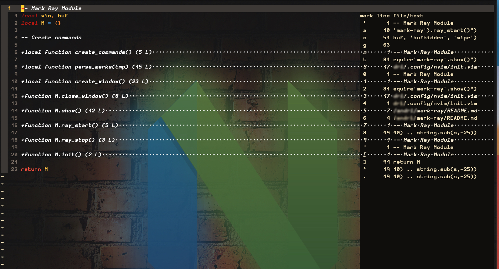

Mark Ray
========
This is a simple plugin written in lua.
It displays your current marks in a window, with line numbers and the start of the file.
I do this to learn lua. It is heavily inspired by
[jump-ray](https://github.com/sbulav/jump-ray.nvim).

